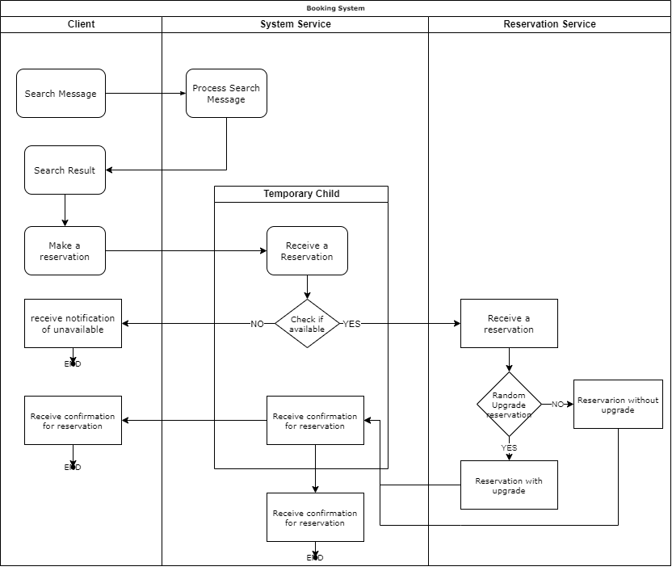

# Actor-Based-Pattern
An online booking system based on a micro-service architecture. Clients of the system can search and reserve properties in hotels, apartments or resorts. The setup will contain the following set of necessary actors:
- A Client is identified by its name, age and passport number.
- A SystemService will handle the communication with the Client.
- A ReservationService will process the reservations requested by the Client through the SystemService.

### _This project is an assignment of software architecture (2021-2022) course at the Vrije Universiteit Brussel under the supervision of Dr. Coen De Roover._

### LIBRARIES
For the development of the online booking system based on a micro-service architecture: Akka Actors versión 2.5.32

### Structure
The development of the solution use the Ask pattern structure and the Business-Handshake pattern structure. The ask pattern was used for the creation of the ephemeral child actor of the SystemService, and the business-handshake pattern was implemented between the ephemeral child and the ReservationService to handle reservations. See Figure below.

